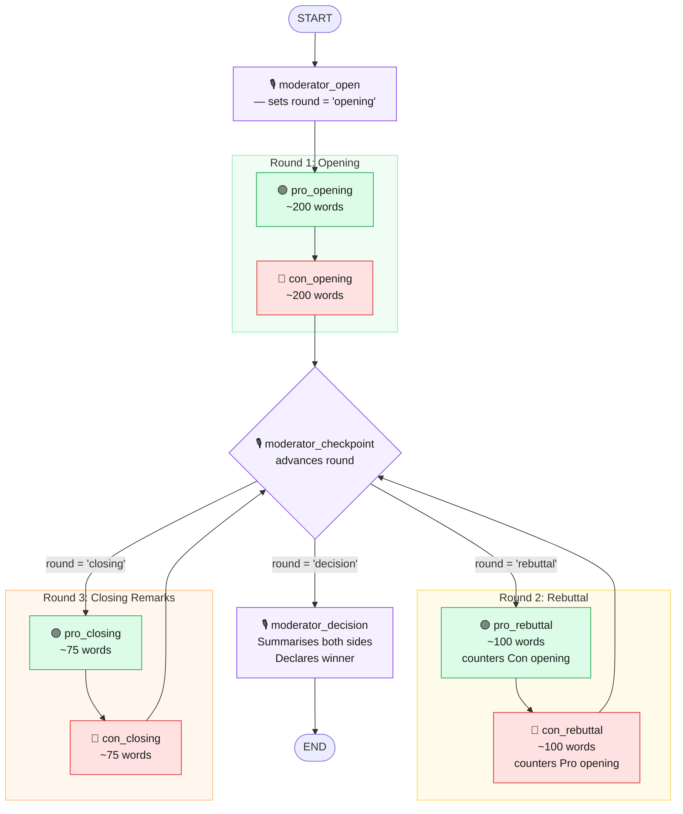

# Debate Graph — Node Diagram

## Mermaid Flowchart



---

## Node Legend

| Symbol | Role | LLM Call? | Visits per debate |
|--------|------|-----------|-------------------|
| 🎙️ Moderator (open) | Sets initial round state | No | 1 |
| 🎙️ Moderator (checkpoint) | Advances round, conditional branch | No | 3 |
| 🎙️ Moderator (decision) | Summarises + declares winner | Yes | 1 |
| 🟢 Pro Agent | Argues in favour | Yes | 3 (opening, rebuttal, closing) |
| 🔴 Con Agent | Argues against | Yes | 3 (opening, rebuttal, closing) |

---

## Conditional Edge Routing (moderator_checkpoint)

```
state["round"] after checkpoint  →  next node
─────────────────────────────────────────────
"opening"   sets → "rebuttal"   →  pro_rebuttal
"rebuttal"  sets → "closing"    →  pro_closing
"closing"   sets → "decision"   →  moderator_decision
```

The same physical node (`moderator_checkpoint`) is visited 3 times — it reads and writes `state["round"]` each time to drive the branch.

---

## Key Design Principle

> The Moderator **gates every round transition**. Pro and Con never advance the debate themselves — they only respond to what was said. All routing authority sits in `moderator_checkpoint`.
