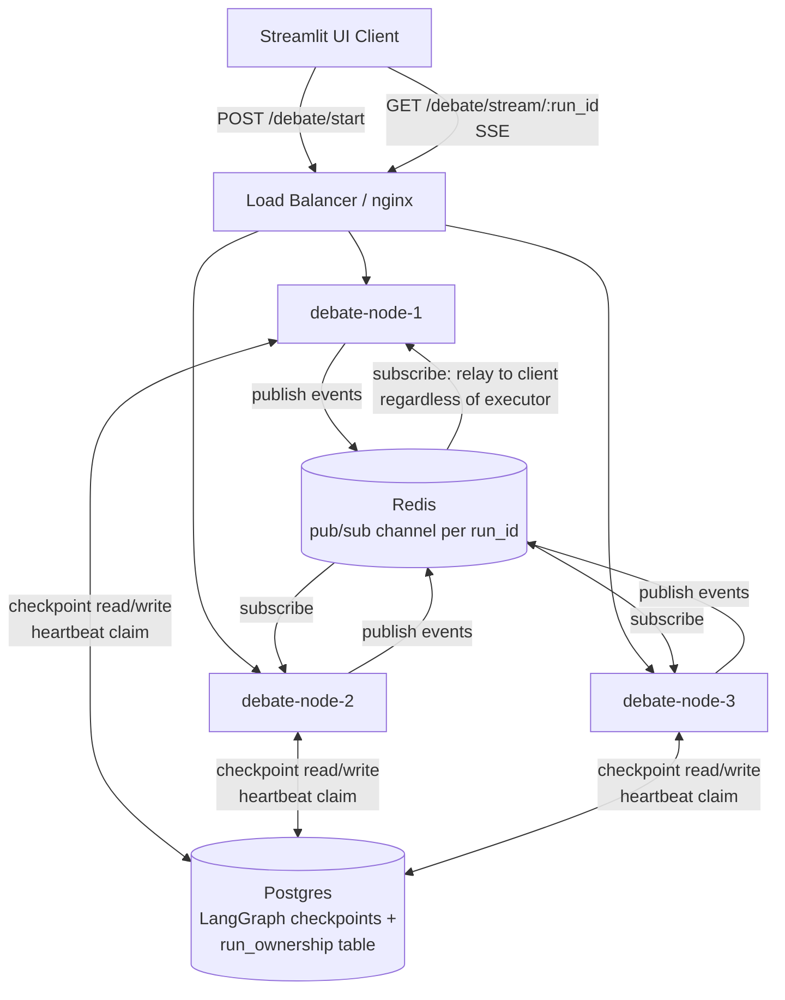

# Multi-Node Debate Agent Server — TRD & Architecture

## 1. Goal

Demonstrate, locally, that:

1. A debate run survives the crash of the node that started executing it — a different
   node picks it up mid-debate and carries it to completion.
2. A UI client watches the debate stream live, through a load balancer, without caring
   which backend node is actually doing the work.
3. Redis's specific job in this system is visible and demonstrable in isolation
   (kill a *non-executing* node that's only relaying a stream vs. kill the *executing*
   node — the two failures look different, and that difference is the point of the demo).

This is a hand-rolled version of the pattern used by LangGraph's hosted Agent Server
(Postgres for durable run/thread state, Redis for pub/sub streaming). We are not using
that product — self-hosting it requires an Enterprise license key
(`LANGGRAPH_CLOUD_LICENSE_KEY`) verified against `beacon.langchain.com`, which we don't
have. Everything below uses only open-source packages.

## 2. Why the current app can't do this

| Current state | File | Problem |
|---|---|---|
| `g.compile()` — no checkpointer | [`src/core/graph.py:55`](../src/core/graph.py#L55) | No durable record of graph progress. If the process dies, an in-progress debate is gone — there's nothing for another node to resume from. |
| `graph.astream(initial_state)` streamed directly into the HTTP response | [`src/api/services/debate_service.py:87`](../src/api/services/debate_service.py#L87) | Execution and the client connection are the same process/request. There is no concept of a `run_id` a second node could attach to. |
| `MemoryStore` (Chroma/InMemoryVectorStore) | [`src/core/memory.py`](../src/core/memory.py) | This is RAG context (past debate summaries), unrelated to resuming in-flight execution. Left as-is. |
| Single container, no LB | [`docker-compose.yml`](../docker-compose.yml) | Only one node exists — nothing to fail over to. |

Two distinct failure modes matter here, and they need different fixes:

- **Client disconnects, executing node is fine** → just needs the stream re-attachable.
  Redis pub/sub alone is enough for this.
- **The executing node itself dies** → needs graph state checkpointed somewhere durable
  (Postgres), plus a way for another node to notice the owner is dead and resume.
  Redis pub/sub does *not* solve this by itself — it has no memory of state, only
  live messages to whoever is currently subscribed.

## 3. Target Architecture

**Request flow:**

1. UI calls `POST /debate/start {topic}` on whichever node the LB picks. That node
   generates a `run_id` (UUID), writes an initial row to Postgres, and returns
   `{run_id}` immediately (it does not execute yet).
2. UI opens `GET /debate/stream/{run_id}` (SSE) — again, LB may route this to *any*
   node, not necessarily the one that created the run.
3. Whichever node receives the stream request:
   - Subscribes to Redis channel `debate:{run_id}` first (so it never misses an event).
   - Checks the Postgres `run_ownership` table for `run_id`:
     - **Unowned, or owner's heartbeat is stale (> 10s old)** → this node claims
       ownership (writes its `NODE_ID` + fresh heartbeat) and starts/resumes graph
       execution via `graph.astream(None, config={"configurable": {"thread_id": run_id}})`
       using the Postgres checkpointer — LangGraph resumes from the last completed
       node automatically. As each node finishes, this node publishes the event to
       Redis (and also relays it to its own client, since it's already subscribed)
       and refreshes its heartbeat.
     - **Owned by a node with a live heartbeat** → this node does *not* execute
       anything. It only relays whatever arrives on the Redis subscription to its
       client. This is the case that proves Redis's specific job: this node is
       doing zero graph work, purely message relay.
4. If the executing node dies, its heartbeat goes stale. The client's `EventSource`
   reconnects (browsers do this automatically on a dropped SSE connection), the LB
   routes the reconnect to a live node, that node sees the stale heartbeat, claims
   ownership, and resumes from the last Postgres checkpoint — continuing the same
   debate rather than restarting it.

## 4. Key Design Decisions

- **Checkpointer = Postgres** (`langgraph-checkpoint-postgres`, open source). This is
  the piece that makes resumption possible at all; Redis cannot substitute for it.
- **Ownership table, not a distributed lock service.** A simple Postgres row with a
  heartbeat timestamp is enough for a local demo — no need for Redis-based locks or
  a leader election library. Postgres is already the source of truth for durable state.
- **`thread_id == run_id`.** LangGraph's checkpointer keys state by `thread_id`; reusing
  the run's own UUID as the thread id keeps the model simple (one thread per debate).
- **SSE over WebSockets.** The app already uses SSE (`debates.py`); no reason to switch.
  nginx needs `proxy_buffering off` and a long read timeout for SSE to work through the LB.
- **Out of scope for this demo:** authentication, TLS, autoscaling, production secrets
  management, exactly-once delivery guarantees beyond "good enough to demo," and
  replacing `MemoryStore` (RAG context) — that store is unrelated to this problem.

## 5. Tasks (execute in order — each depends on the previous)

### Task 1 — Postgres checkpointer for durable graph state
**Objective:** A debate's execution progress survives a process restart.
- Add `langgraph-checkpoint-postgres`, `psycopg[binary,pool]` to `requirements.txt`.
- `src/core/graph.py`: accept a `checkpointer` param in `build_graph()`, pass to
  `g.compile(checkpointer=checkpointer)`.
- `app.py`: construct an `AsyncPostgresSaver` from `DATABASE_URL`, call `.setup()` once
  at startup to create the checkpoint tables.
- `src/api/services/debate_service.py`: `stream_debate` takes a `run_id` and passes
  `config={"configurable": {"thread_id": run_id}}` into `graph.astream(...)`.
- **Acceptance:** start a debate, let 2-3 nodes execute, kill the process (Ctrl+C),
  restart it, call resume with the same `run_id` — it continues instead of restarting.
  Confirm via `SELECT * FROM checkpoints` in Postgres.

### Task 2 — Redis pub/sub streaming relay
**Objective:** Any node can stream a run's events to a client, regardless of which
node is executing it.
- Add `redis` (redis.asyncio) to `requirements.txt`.
- New `deployment/app_ext/event_bus.py`: `publish(run_id, event)` / `subscribe(run_id)`
  wrapping Redis pub/sub.
- Executing node publishes each `graph.astream` event to `debate:{run_id}` instead of
  (or in addition to) yielding directly.
- `/debate/stream/{run_id}` route subscribes to Redis and streams whatever arrives.
- **Acceptance:** run two local instances on different ports, both pointed at the same
  Redis. Start a debate via instance A; connect the SSE client to instance B. Instance B
  streams the full debate despite never executing a single graph node.

### Task 3 — Run ownership + heartbeat (automatic failover)
**Objective:** A surviving node detects a dead executor and resumes the same run.
- Postgres table `run_ownership(run_id PK, node_id, heartbeat_at, status)`.
- `NODE_ID` env var (container hostname) identifies each node.
- Claim logic: `INSERT ... ON CONFLICT (run_id) DO UPDATE ... WHERE run_ownership.heartbeat_at < now() - interval '10 seconds'`.
- Executing node refreshes its heartbeat every ~3s in a background task while running.
- Stream route: unowned/stale → claim + execute (Task 1); owned + live → relay only (Task 2).
- **Acceptance:** `docker kill` the container currently executing a debate. Within
  ~10-15s, a different node claims the run and the debate resumes to completion —
  not restarted from the top, not duplicated.

### Task 4 — Multi-node local infrastructure
**Objective:** Multiple replicas + a load balancer, runnable with tools you already know.
- `deployment/docker-compose.local.yml`: `postgres`, `redis`, 3x `debate-node`
  (same image, distinct `NODE_ID`), `nginx` LB on `:8080` with `proxy_buffering off`
  and long `proxy_read_timeout` for SSE.
- `deployment/nginx.conf`.
- `deployment/k8s/`: `Deployment` (replicas: 3) + `Service` for the app, plus
  Postgres/Redis manifests (or reuse compose ones via port-forward for a kind/minikube demo).
- **Acceptance:** `docker compose -f deployment/docker-compose.local.yml up`, confirm
  3 healthy nodes, confirm requests round-robin across `NODE_ID`s (visible in logs/response header).

### Task 5 — UI client + failover demo script
**Objective:** A visible, repeatable demo.
- `deployment/ui/streamlit_app.py`: topic input → `POST /debate/start` via the LB →
  `GET /debate/stream/{run_id}` rendered live, labeling each event with the `NODE_ID`
  that produced it (proves cross-node handoff visually).
- `deployment/demo_failover.sh`: starts the stack, kicks off a debate, waits a few
  seconds, `docker kill`s the executing node's container, and the operator watches
  the UI confirm the debate resumes elsewhere and completes with a winner.
- **Acceptance:** full run — start topic in UI, watch live streaming, kill the
  executing node mid-debate, watch it resume on a different node and finish exactly once.

## 6. Sequencing

Tasks are strictly ordered: 1 → 2 → 3 → 4 → 5. Each is independently testable before
moving to the next (acceptance criteria above). Do not skip ahead — Task 3's failover
logic depends on Task 1's resumability and Task 2's relay both already working.
