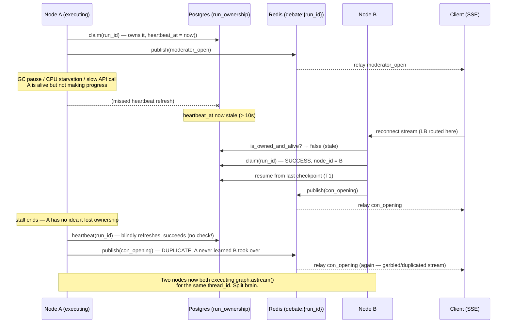
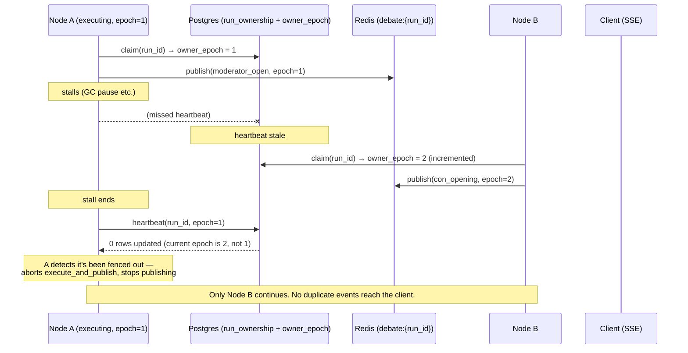

# T3.1 — Handling the "Briefly-Slow Node" Race (Reference, Not a Demo Task)

## Status: Optional / Not Implemented

This is **not** part of the T1→T5 execution sequence and is **not needed for the demo**
to work. Nothing here should be built unless someone specifically asks the question
below. This document exists so there's a good answer ready:

> "Your failover is based on a heartbeat timeout. What stops a node that's merely
> *slow* (GC pause, CPU starvation, a slow upstream call) — not actually dead — from
> having its run stolen out from under it, and then both nodes executing the same
> debate at once?"

## The Problem

T3's claim query treats "heartbeat older than N seconds" as equivalent to "node is
dead." Those are not the same thing, and no choice of N fixes that:

- **N too small** (e.g. 5s): a node that's alive but briefly stalled looks dead.
  Another node steals the run while the original is still going to act on it.
- **N too large** (e.g. 10s+): a genuinely dead node isn't detected fast enough —
  the failover looks unconvincing on camera, but at least it's *correct*.

Shrinking the window trades a cosmetic problem (slow failover) for a correctness
problem (duplicate execution). It doesn't eliminate the race, it just changes how
often it's hit. As currently written, T3 has no mechanism to stop the "declared
dead" node from continuing to act once it wakes back up — it will keep writing
checkpoints and publishing to Redis, unaware anything happened.

## Sequence: How the Race Actually Plays Out (current T3 design)



The failure isn't "the timeout was the wrong number." It's that **Node A never
checks whether it's still allowed to act** before it acts. Any timeout value has
some stall duration that exceeds it.

## The Fix: Fencing Tokens (Epoch-Gated Writes)

This is the standard answer from distributed systems (the pattern behind
Chubby/ZooKeeper leases, and Martin Kleppmann's critique of naive Redlock-style
locking): don't try to pick a timeout that's never wrong. Instead, make it *safe*
to be wrong, by gating every side effect on a monotonically increasing token.

- Add `owner_epoch INTEGER` to `run_ownership`, incremented on every successful claim.
- Every write the executing node makes (heartbeat refresh, checkpoint write, Redis
  publish) is gated on "is my epoch still current" — not just "does the row exist."
- If Node A's epoch has been superseded, its next write affects 0 rows / fails the
  check, and A aborts its `execute_and_publish` loop immediately instead of
  continuing blindly.



Node A isn't prevented from *waking up* — it's prevented from *mattering* once it
does. This makes the staleness window a pure UX/liveness knob again: you can set
it to 3-5 seconds for a snappier demo with no correctness downside, because a
false-positive steal now just means A quietly stands down instead of corrupting
the stream.

## What Would Actually Change (if this were ever implemented)

- `run_ownership` gains `owner_epoch INTEGER NOT NULL DEFAULT 0`.
- `claim(run_id, node_id)` increments `owner_epoch` on success and returns the new
  value to the caller.
- `heartbeat(run_id, node_id, epoch)` becomes conditional:
  ```sql
  UPDATE run_ownership
  SET heartbeat_at = now()
  WHERE run_id = %s AND node_id = %s AND owner_epoch = %s
  ```
  Zero rows affected → the caller has been fenced out.
- `execute_and_publish`'s background heartbeat loop checks the affected-row-count
  on every refresh (not just on the initial claim) and cancels the graph execution
  task the moment it sees it's lost its epoch, instead of only checking ownership
  once at claim time.
- The Redis publish step ideally carries the epoch too, so a relay-only node could
  in principle detect and drop stray events from a fenced-out publisher — not
  strictly required for the demo's correctness (Postgres is still the source of
  truth), but tidies up the stream if a fenced write slips out before the abort
  is noticed.

## Why This Is Out of Scope for the Demo

Per `TRD_ARCHITECTURE.md` section 4, this demo is scoped to "good enough to demo,"
not exactly-once guarantees. The current T3 design is fine for a live demo because:
- The demo script (`demo_failover.sh`) kills the node with `docker kill` — a hard,
  immediate death, not a stall. There's no "node wakes back up" case to trigger the
  race in the first place.
- The 10s window is generous enough that ordinary demo-machine jitter won't false-positive.

This document exists purely so the race and its standard fix can be explained
clearly if asked — not because it needs to be built before the demo.
